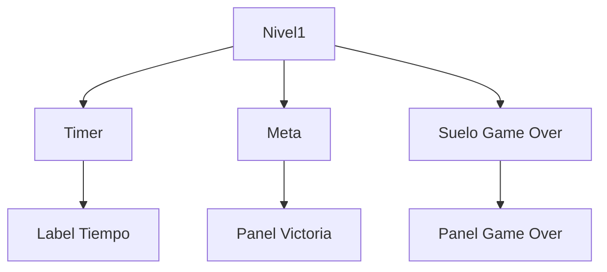

# Proyecto Juego

Un juego de plataformas desarrollado en Godot Engine 4.3 con sistema de niveles, temporizador y gestión de estados del jugador. El proyecto implementa mecánicas básicas de juego con detección de colisiones, transiciones entre escenas y seguimiento del tiempo de juego. [1](#0-0) 

## Descripción

Este proyecto es un videojuego 2D desarrollado con Godot Engine que ofrece una experiencia de juego de plataformas con las siguientes características principales:

- Sistema de niveles con transiciones automáticas
- Temporizador de juego que registra el rendimiento del jugador
- Gestión de estados (victoria y game over)
- Interfaz de usuario intuitiva con menús y paneles informativos
- Control de personaje con soporte para teclado y gamepad

El juego utiliza una arquitectura basada en nodos de Godot, aprovechando el sistema de escenas y señales del motor para crear una experiencia fluida y escalable. [2](#0-1) 

## Tecnologías Utilizadas

| Tecnología | Versión | Uso en el Proyecto |
|------------|---------|-------------------|
|  | 4.3 | Motor de juego principal |
|  | 4.3 | Lenguaje de programación |
|  | - | Control de versiones |

## Arquitectura

El proyecto sigue la arquitectura basada en escenas de Godot Engine, organizada de la siguiente manera:

### Estructura de Nodos
- **Nivel1**: Nodo principal que gestiona el temporizador y la lógica del nivel
- **Meta**: Área de detección para la victoria
- **Suelo Game Over**: Área que detecta caídas y activa el game over
- **Paneles UI**: Escenas separadas para menús y estados del juego

### Flujo de Datos


El sistema utiliza señales de Godot para la comunicación entre componentes, permitiendo un desacoplamiento efectivo entre la lógica del juego y la interfaz de usuario. [3](#0-2) 

## Instalación y Configuración

### Requisitos Previos
- Godot Engine 4.3 o superior
- Sistema operativo: Windows, Linux o macOS

### Pasos de Instalación

1. **Clonar el repositorio**
   ```bash
   git clone https://github.com/Detmermt3/JuegoHechoEnGodot.git
   cd JuegoHechoEnGodot
   ```

2. **Abrir en Godot**
   - Ejecuta Godot Engine
   - Selecciona "Importar" y elige la carpeta del proyecto
   - Abre el proyecto

3. **Configurar la escena principal**
   - La escena principal está configurada en `res://paneles/panel_menuprincipal/menu_principal.tscn` [4](#0-3) 

4. **Ejecutar el proyecto**
   - Presiona F5 en Godot o haz clic en el botón de reproducción

### Configuración de Controles

El juego soporta los siguientes controles: [5](#0-4) 

| Acción | Teclado | Gamepad |
|--------|---------|---------|
| Mover Izquierda | A | Stick Izquierdo Izquierda |
| Mover Derecha | D | Stick Izquierdo Derecha |
| Mover Arriba | W | Stick Izquierdo Arriba |
| Mover Abajo | S | Stick Izquierdo Abajo |

## Funcionalidades Clave

### Sistema de Temporizador
- Implementa un contador de tiempo en segundos que se inicia al comenzar el nivel
- El tiempo se muestra en pantalla mediante un label actualizado en tiempo real
- El tiempo final se pasa a los paneles de victoria y game over para su visualización [6](#0-5) 

### Gestión de Estados
- **Victoria**: Al alcanzar la meta, el juego transiciona al panel de victoria mostrando el tiempo obtenido
- **Game Over**: Detecta caídas y activa el panel de game over con el tiempo registrado
- **Transiciones Suaves**: Utiliza el sistema de escenas de Godot para cambios sin interrupciones [7](#0-6) 

### Optimización de Rendimiento
- Ventana de juego optimizada con tamaño fijo de 650x648 píxeles
- Sistema de detección de colisiones eficiente mediante áreas de Godot
- Gestión de memoria adecuada con liberación de escenas no utilizadas [8](#0-7) 

## Sobre el Autor

Desarrollado por un Técnico Superior en Desarrollo de Aplicaciones Multiplataforma con especialización en Full-Stack y soluciones de escritorio. Aunque el stack principal incluye Java (Avanzado/MVC), Python (Django) y C#/.NET, este proyecto demuestra la versatilidad para adaptarse a diferentes tecnologías y motores de juego como Godot Engine.

El enfoque se centra en crear código limpio, escalable y mantenible, aplicando principios de diseño de software sólidos independientemente de la tecnología utilizada. Este proyecto representa la capacidad de aprender rápidamente nuevas herramientas y aplicar buenas prácticas de desarrollo en diferentes contextos tecnológicos.

---

## Notas

Este README está basado en el contenido real del repositorio, que es un juego desarrollado en Godot Engine con GDScript. Aunque el perfil del desarrollador menciona experiencia en Java, Python y C#, el proyecto actual utiliza la tecnología de Godot para demostrar versatilidad y capacidad de adaptación a diferentes entornos de desarrollo.

El código incluye manejo de errores robusto con verificación de métodos antes de su ejecución y mensajes de depuración informativos para facilitar el mantenimiento y la extensión del proyecto. [9](#0-8)

### Citations

**File:** project.godot (L13-16)
```text
config/name="Proyecto Juego"
run/main_scene="res://paneles/panel_menuprincipal/menu_principal.tscn"
config/features=PackedStringArray("4.3", "Forward Plus")
config/icon="res://icon.svg"
```

**File:** project.godot (L36-58)
```text
move_left_izq={
"deadzone": 0.5,
"events": [Object(InputEventKey,"resource_local_to_scene":false,"resource_name":"","device":-1,"window_id":0,"alt_pressed":false,"shift_pressed":false,"ctrl_pressed":false,"meta_pressed":false,"pressed":false,"keycode":0,"physical_keycode":65,"key_label":0,"unicode":97,"location":0,"echo":false,"script":null)
, Object(InputEventJoypadMotion,"resource_local_to_scene":false,"resource_name":"","device":-1,"axis":0,"axis_value":-1.0,"script":null)
]
}
move_right_izq={
"deadzone": 0.5,
"events": [Object(InputEventKey,"resource_local_to_scene":false,"resource_name":"","device":-1,"window_id":0,"alt_pressed":false,"shift_pressed":false,"ctrl_pressed":false,"meta_pressed":false,"pressed":false,"keycode":0,"physical_keycode":68,"key_label":0,"unicode":100,"location":0,"echo":false,"script":null)
, Object(InputEventJoypadMotion,"resource_local_to_scene":false,"resource_name":"","device":-1,"axis":0,"axis_value":1.0,"script":null)
]
}
move_up_izq={
"deadzone": 0.5,
"events": [Object(InputEventKey,"resource_local_to_scene":false,"resource_name":"","device":-1,"window_id":0,"alt_pressed":false,"shift_pressed":false,"ctrl_pressed":false,"meta_pressed":false,"pressed":false,"keycode":0,"physical_keycode":87,"key_label":0,"unicode":119,"location":0,"echo":false,"script":null)
, Object(InputEventJoypadMotion,"resource_local_to_scene":false,"resource_name":"","device":-1,"axis":1,"axis_value":-1.0,"script":null)
]
}
move_down_izq={
"deadzone": 0.5,
"events": [Object(InputEventKey,"resource_local_to_scene":false,"resource_name":"","device":-1,"window_id":0,"alt_pressed":false,"shift_pressed":false,"ctrl_pressed":false,"meta_pressed":false,"pressed":false,"keycode":0,"physical_keycode":83,"key_label":0,"unicode":115,"location":0,"echo":false,"script":null)
, Object(InputEventJoypadMotion,"resource_local_to_scene":false,"resource_name":"","device":-1,"axis":1,"axis_value":1.0,"script":null)
]
```

**File:** mapa/nivel1/nivel_1.gd (L1-10)
```text
extends Node2D

var time_elapsed: int = 0  # Variable para almacenar el tiempo transcurrido

func _ready():
	pass # Replace with function body.
	# Establecer el tamaño de la ventana en el nivel 1
	call_deferred("_set_window_size")
	$Timer.start()  # Iniciar el Timer al comienzo
	update_label()  # Actualizar la pantalla inicialmente
```

**File:** mapa/nivel1/nivel_1.gd (L12-20)
```text
func _set_window_size() -> void:
	var window_size = Vector2(650, 648)
	get_tree().root.set_size(window_size)
	
	DisplayServer.window_set_flag(DisplayServer.WINDOW_FLAG_RESIZE_DISABLED, true)
	
	var screen_size = Vector2(DisplayServer.screen_get_size())  
	var position = (screen_size - window_size) / 2
	DisplayServer.window_set_position(position)
```

**File:** mapa/nivel1/nivel_1.gd (L25-31)
```text
func _on_timer_timeout() -> void:  
	time_elapsed += 1  # Incrementa el contador cada segundo
	update_label()  

# Función para obtener el tiempo cuando se termine el nivel
func get_final_time() -> int:
```

**File:** mapa/nivel1/meta.gd (L5-11)
```text
func _on_body_entered(body):
	var nivel = get_parent()  # Obtener el nodo Nivel1

	if nivel.has_method("get_final_time"):  # Verificar si tiene la función
		var final_time = nivel.get_final_time()  # Obtener el tiempo final
		print("🏆 Tiempo final obtenido:", final_time)

```

**File:** mapa/nivel1/meta.gd (L18-23)
```text
			# Verificar si el nodo tiene la función antes de llamarla
			if victoria_scene.has_method("set_time_elapsed"):
				print("✅ Pasando el tiempo al panel de victoria")
				victoria_scene.set_time_elapsed(final_time)  # Pasar el tiempo
			else:
				print("❌ ERROR: panel_victoria.tscn no tiene set_time_elapsed()")
```

**File:** mapa/nivel1/suelo_game_over.gd (L11-17)
```text
func _on_body_entered(body):
	if has_moved:  # Solo activar si el jugador ya se ha movido
		var nivel = get_parent()  # Obtener el nodo Nivel1
		if nivel.has_method("get_final_time"):  # Verificar si tiene la función
			var final_time = nivel.get_final_time()  # Obtener el tiempo final
			print("Tiempo final en perder:", final_time)

```
